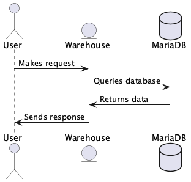
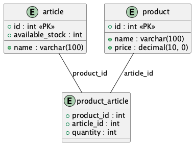

# Warehouse Service

This is a simple Warehouse Service built with Spring Boot (Reactive/Webflux), Docker and MariaDB 
for keeping track on products and articles for sale.

## Prerequisites

Before running the service, ensure you have the following installed on your machine:
- [Docker](https://www.docker.com/get-started)
- [Docker Compose](https://docs.docker.com/compose/)

## Setup Instruction
1. **Clone the repository**:
   - git clone https://github.com/Robbz92/WarehouseAPI.git
   - cd WarehouseAPI

2. **Configuration**:
   *Docker*:
    - MYSQL_ROOT_PASSWORD=your_password
    - MYSQL_PASSWORD=your_password
        
   **application.yaml**:
   - password your_password

3. **Generate Docker-image**:
    - docker-compose up
    - start up container
      
      *no need to run from intelij because everything is wrapped in docker.
      i have also included a init.sql to pre-load the database tables.*
  
## Swagger-page
* url: localhost:8080/webjars/swagger-ui/index.html

## API Flow Diagram

## Database Relationship Diagram

